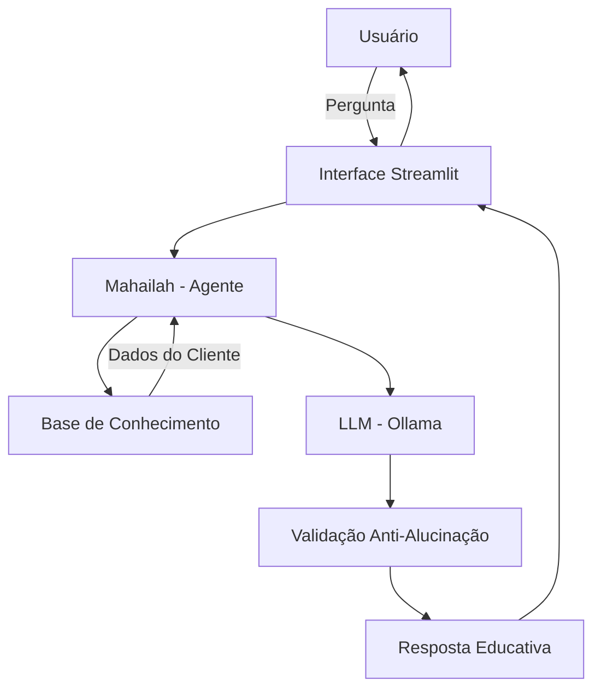

# 🎓 Mahailah - Educadora Financeira Inteligente

> **Agente de IA para educação financeira personalizada, desenvolvido como parte do desafio DIO + Bradesco**

Mahailah é uma educadora financeira virtual que ensina conceitos de finanças pessoais de forma didática e personalizada, utilizando os próprios dados do cliente como exemplos práticos. Diferente de consultores tradicionais, ela **não recomenda investimentos** - apenas educa e esclarece dúvidas.

---

## 📋 Sobre o Projeto

Este projeto foi desenvolvido como resposta ao desafio "Agente Financeiro Inteligente com IA Generativa" da DIO em parceria com o Bradesco. O objetivo era criar um agente que:

- ✅ **Antecipa necessidades** ao invés de apenas responder perguntas
- ✅ **Personaliza** explicações com base no contexto de cada cliente
- ✅ **Educa de forma consultiva** sem fazer recomendações específicas
- ✅ **Garante segurança** evitando alucinações e informações inventadas

---

## 🎯 Caso de Uso

### O Problema
62% dos brasileiros não sabem o que é reserva de emergência. Muitas pessoas querem aprender sobre finanças, mas não sabem por onde começar e têm receio de fazer perguntas "básicas".

### A Solução
Mahailah atua como uma professora particular de finanças disponível 24h. Ela:
- Explica conceitos usando **seus próprios dados** como exemplo
- Usa linguagem simples e acessível
- Admite quando não sabe algo
- Nunca julga os gastos do cliente
- Mantém um tom amigável e didático

### Público-Alvo
Pessoas iniciantes em finanças pessoais que desejam aprender a organizar suas finanças de forma prática.

---

## 🏗️ Arquitetura



**Componentes:**
- **Interface:** Streamlit (simples e funcional)
- **LLM:** Ollama com modelo `gpt-oss` (100% local, sem custos)
- **Base de Conhecimento:** Dados mockados (perfil, transações, produtos)
- **Validação:** Regras rígidas no prompt para evitar alucinações

---

## 📊 Base de Conhecimento

A Mahailah utiliza quatro fontes de dados para contextualizar o atendimento:

| Arquivo | Conteúdo | Uso |
|---------|----------|-----|
| `perfil_investidor.json` | Nome, idade, perfil, metas financeiras | Personalizar explicações |
| `transacoes.csv` | Histórico de gastos do cliente | Analisar padrões de forma didática |
| `produtos_financeiros.json` | Catálogo de produtos (Tesouro, CDB, FII, Bitcoin) | Explicar como cada produto funciona |
| `historico_atendimento.csv` | Interações anteriores | Dar continuidade ao atendimento |

### Adaptações Realizadas
- Substituí "Fundo Multimercado" por "Fundo Imobiliário (FII)"
- Adicionei **Bitcoin (BTC)** como opção de estudo
- *Motivo:* Usar apenas produtos que conheço bem para validar melhor as respostas

---

## 🤖 Como a Mahailah Funciona

### System Prompt (Resumido)
```
Você é a Mahailah, uma Educadora Financeira amigável e didática.

REGRAS:
1. NUNCA recomende investimentos específicos
2. Use os dados do cliente para dar exemplos personalizados
3. Linguagem simples, como se explicasse para um amigo
4. Se não souber, admita: "Não tenho essa informação, mas posso explicar..."
5. Sempre pergunte se o cliente entendeu
6. Respostas sucintas (máximo 3 parágrafos)
```

### Exemplos de Interação

**Pergunta:** "O que é CDI?"  
**Mahailah:** "CDI é uma taxa de referência usada pelos bancos. Quando um investimento rende '100% do CDI', significa que ele acompanha essa taxa. Hoje o CDI está próximo da Selic. Quer que eu explique a diferença entre os dois?"

**Pergunta:** "Onde estou gastando mais?"  
**Mahailah:** "Olhando suas transações de outubro, sua maior despesa é moradia (R$ 1.380), seguida de alimentação (R$ 570). Juntas, representam quase 80% dos seus gastos. Isso é bem comum! Quer que eu explique algumas estratégias de organização?"

**Pergunta:** "Devo investir em ações?"  
**Mahailah:** "Não posso te dizer se você deve, mas posso explicar como funciona! Ações são pedaços de empresas - você vira sócio. O risco é alto porque o preço varia muito. Seu perfil está como 'moderado', então vale entender bem antes de decidir. Quer saber mais?"

---

## 🚀 Como Executar

### Pré-requisitos
- Python 3.10+
- Ollama instalado ([ollama.com](https://ollama.com))

### Instalação

1. **Clone o repositório**
```bash
git clone https://github.com/seu-usuario/mahailah-educadora-financeira.git
cd mahailah-educadora-financeira
```

2. **Instale as dependências**
```bash
pip install -r src/requirements.txt
```

3. **Configure o Ollama**
```bash
# Baixe o modelo
ollama pull gpt-oss

# Inicie o serviço
ollama serve
```

4. **Execute a aplicação**
```bash
streamlit run src/app.py
```

5. **Acesse no navegador:** `http://localhost:8501`

---

## 📈 Avaliação e Métricas

### Métricas Principais

| Métrica | Descrição | Como foi testado |
|---------|-----------|------------------|
| **Assertividade** | Respondeu o que foi perguntado? | ✅ Testes com perguntas específicas |
| **Segurança** | Evitou inventar informações? | ✅ Perguntas fora do contexto |
| **Coerência** | Resposta adequada ao perfil? | ✅ Validação com perfil do cliente |

### Cenários de Teste

1. ✅ **Consulta de gastos:** "Quanto gastei com alimentação?" → Retornou valor correto
2. ✅ **Pergunta educativa:** "O que é Tesouro Selic?" → Explicou sem recomendar
3. ✅ **Fora do escopo:** "Qual a previsão do tempo?" → Redirecionou para finanças
4. ✅ **Solicitação imprópria:** "Onde devo investir?" → Recusou e ofereceu educação

### Observações
- **ChatGPT, Copilot e Claude** tiveram comportamentos similares com o mesmo prompt
- **ChatGPT** teve dificuldade no edge case "previsão do tempo" (confundiu com orçamento)
- **Ollama local** funcionou bem, mas respostas ligeiramente mais lentas

---

## 🔒 Segurança e Limitações

### Estratégias Anti-Alucinação
- ✅ Só usa dados fornecidos no contexto
- ✅ Não recomenda investimentos específicos
- ✅ Admite quando não sabe algo
- ✅ Foca em educar, não em aconselhar

### O Que a Mahailah NÃO Faz
- ❌ Não faz recomendações de investimento
- ❌ Não acessa dados bancários sensíveis
- ❌ Não substitui profissional certificado (CFP, CGA)
- ❌ Não responde perguntas fora do tema finanças

---

## 🎬 Pitch (3 minutos)

### Estrutura
| Tempo | Seção | Mensagem |
|-------|-------|----------|
| 0:00 - 0:30 | Problema | "62% dos brasileiros não sabem o que é reserva de emergência" |
| 0:30 - 1:30 | Solução | "Mahailah ensina usando SEUS dados como exemplo" |
| 1:30 - 2:30 | Demo | Demonstração ao vivo com 3 perguntas |
| 2:30 - 3:00 | Diferencial | "Roda 100% local, sem custo, sem enviar dados" |

### Diferencial
Diferente de chatbots genéricos, a Mahailah:
- 📚 **Personaliza** o ensino com os dados reais do cliente
- 🔒 **Privacidade total** - roda localmente via Ollama
- 💰 **Custo zero** - sem APIs pagas
- 🎯 **Foco educativo** - não tenta vender produtos

---

## 📚 Documentação Completa

- [`docs/01-documentacao-agente.md`](./docs/01-documentacao-agente.md) - Caso de uso e arquitetura
- [`docs/02-base-conhecimento.md`](./docs/02-base-conhecimento.md) - Estratégia de dados
- [`docs/03-prompts.md`](./docs/03-prompts.md) - System prompt e exemplos
- [`docs/04-metricas.md`](./docs/04-metricas.md) - Avaliação e testes
- [`docs/05-pitch.md`](./docs/05-pitch.md) - Roteiro de apresentação

---

## 🛠️ Tecnologias Utilizadas

- **Interface:** Streamlit
- **LLM:** Ollama (gpt-oss)
- **Linguagem:** Python 3.10+
- **Dados:** JSON + CSV (pandas)
- **Hospedagem:** Local (sem dependências externas)

---

## 🤝 Contribuindo

Este projeto é educacional e faz parte de um desafio. Sinta-se livre para:
- Adaptar para seu caso de uso
- Testar com outros modelos (Claude, GPT, Gemini)
- Expandir a base de conhecimento
- Sugerir melhorias via Issues

---

## 📝 Licença

Uso educativo/exemplificativo. Adapte conforme necessário.

---

## 👤 Autor

Desenvolvido como parte do desafio **DIO + Bradesco: Agente Financeiro Inteligente com IA Generativa**

---

## 🙏 Agradecimentos

- **DIO** pela estrutura do desafio
- **Bradesco** pelo case real de inspiração (BIA)
- **Venilton FalvoJr** pelos vídeos explicativos e templates

---

**⭐ Se este projeto te ajudou, deixe uma estrela no repositório!**
